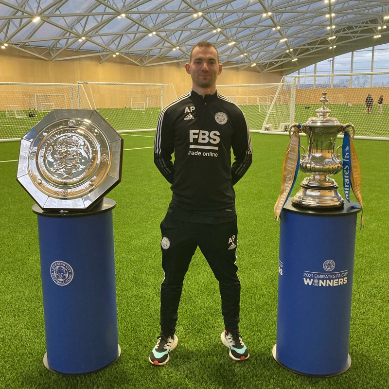

  

&nbsp;

I’m Andrew Peters (PhD), a **Data Scientist** specialising in **Data Visualisation, RShiny development** and **applied machine learning**. 

My work bridges **sports analytics, finance, and pharmaceutical R&D** — turning complex datasets into clear, actionable insights.

Have a look through my **Featured Projects** below which encompass the following areas:

* 📊 Data Visualisation Redesign
* ⚽️ Football Analytics
* 📈 Data Visualisation Portfolio
* 👨‍💻 RShiny Dashboard Development

<!-- ::: {.btn-container} -->
<!-- [View Data Visualisation Portfolio](visualisations.qmd){.btn .btn-outline-secondary} -->
<!-- ::: -->

---

## Featured Projects

### [Data Visualisation Redesign](redesign.qmd)
A showcase of real-world chart redesigns — transforming cluttered visuals into clear stories. The project shares my structured approach to visualisation design and includes a sample *Style Guide* I helped produce to standardise best practices.

{.featured-img}

### [Football Analytics](publications.qmd)
Data-driven insights into tactical performance in elite football — integrating visualisation with data science techniques. This section contains my research published in peer-reviewed journals.

{.featured-img}

### [Data Visualisation Portfolio](visualisations.qmd)
A visual exploration of data across three worlds — **Finance, Fitness, and Football**.
Each section illustrates how clear, purposeful design can reveal the story behind the numbers — from exploring interest rates to performance analytics and fitness insights.

{.featured-img}

### [RShiny Dashboard Development](dashboards.qmd)
Interactive Fantasy Premier League analytics dashboards built in RShiny, focusing on player performance, mini-league data, fixture difficulty and more..

{.featured-img width=60% fig-align="center"}