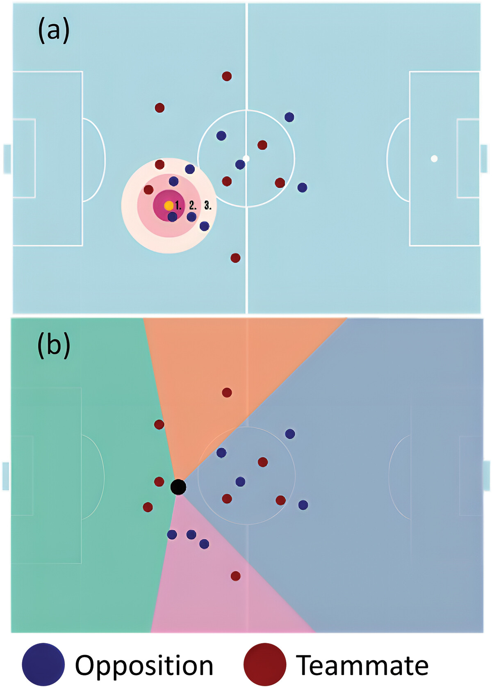
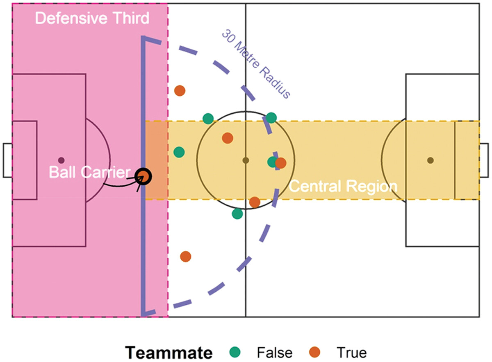
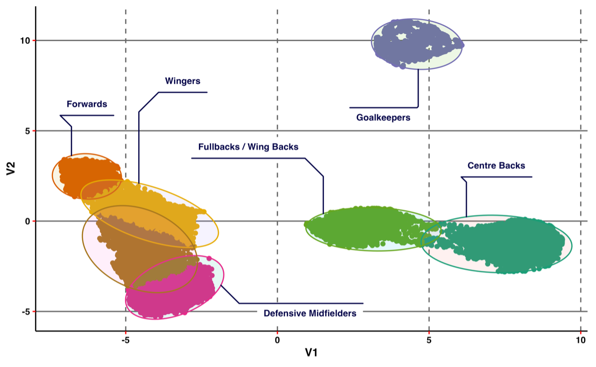
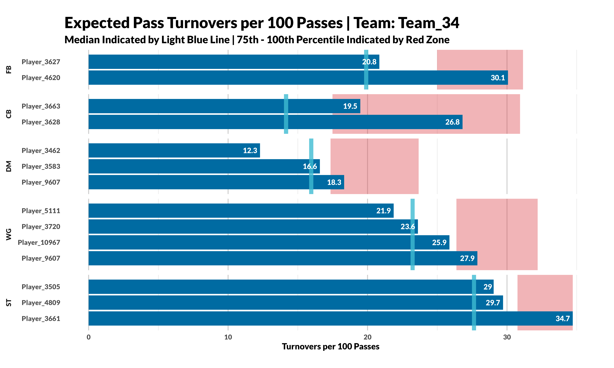
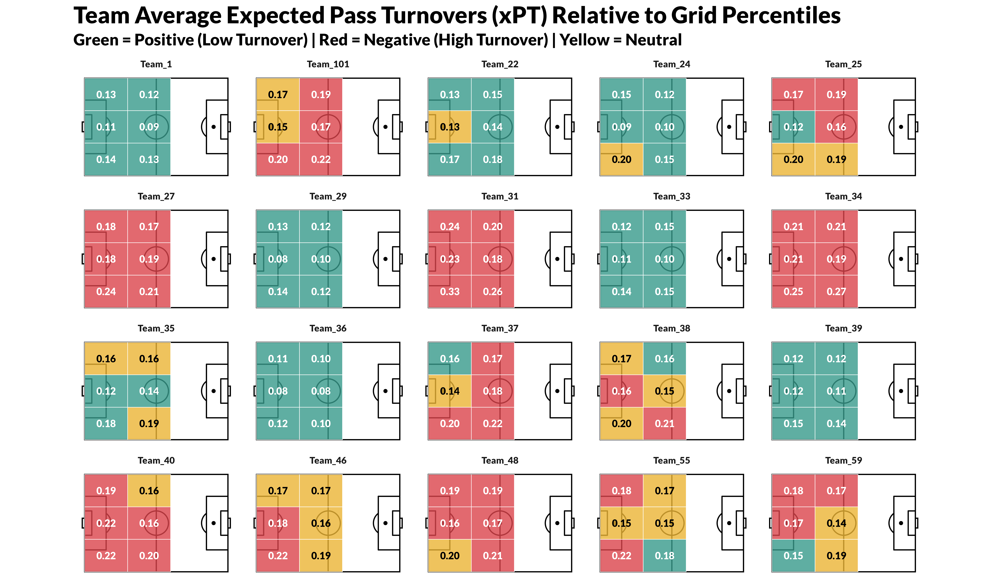
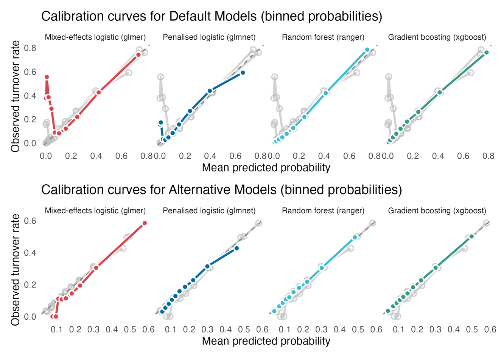
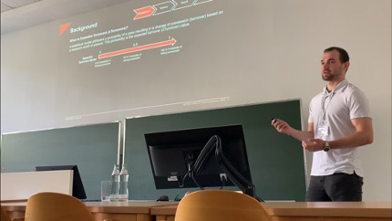
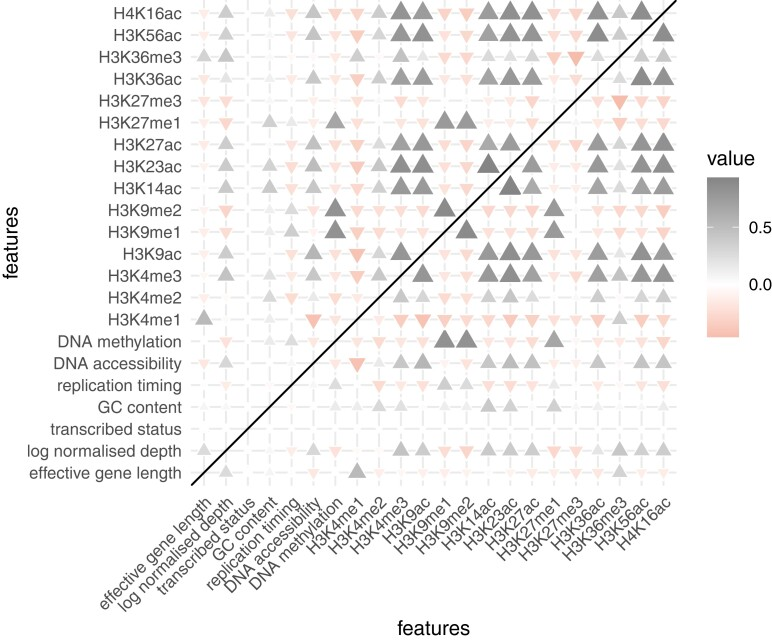

I was fortunate enough to work for Leicester City Football club for 3 years. (→ [Professional Experience](about.qmd))

During this time, I was involved in managing back-end and front-end operations for analytics initiatives across the **Performance Analysis, Sports Science and Recruitment Departments**. I delivered frequent **RMarkdown** & PDF reports and deployed **RShiny** & **Tableau** dashboards acorss all of these departments.

My publications within football analytics include:

- Developing machine learning methods to analyse passing events ([1. Modelling Passing in Football](#xPT-id))
- Investigating the relationship between *Rest Defence* and Counterpressing ([2. Counterpressing in Football](#counterpressing-id))
- Using a semi-supervised machine learning method to characterise pressing roles in football ([3. Defining Pressing Roles in Football](#pressing-roles-id))
- Applying pass models to demonstrate their applications within a professional football environment ([4. Applying an Expected Pass Turnovers Model to Inform Pressing Strategies in Professional Football](#applications-id))
- Evaluating temporal leakage in machine learning models of football pass turnovers ([5. When Timing Matters: Evaluating Temporal Leakage in Machine Learning Models of Football Pass Turnovers](#temporal-leakage-id)).

# 📚 Publications & Research

This section highlights my research work in **football (soccer) analytics**, combining machine learning, modelling and data storytelling to provide actionable insights for practitioner coaches and analysts.

Studies below have been **peer-reviewed and published** in leading sports science journals.

---

### ⚽️ 1. Modelling Passing in Football {#xPT-id}
*Journal of Sport Sciences (2024)*

Expected Pass Turnovers (xPT) - a machine learning approach to analyse turnovers from passing events in football

[Read Paper →](https://www.tandfonline.com/doi/full/10.1080/02640414.2024.2379697)

[Link To GitHub 🔗](https://github.com/andypetes94/ExpectedPassTurnovers/)

**Summary:**  
The aim of this study was to create a novel metric, *Expected Pass Turnovers* (xPT), that could evaluate possession retention from player-passing events in football. 

A logistic mixed-effects model was implemented to attribute the probability of each pass getting turned over. The use of positional data enabled the identification of a) opposition players present in radii surrounding the ball carrier and b) availability of teammates with respect to the ball carrier. 

{width=60% fig-align="center"}

### 🔄 2. Counterpressing in Football {#counterpressing-id} 
*International Journal of Performance Analysis in Sport (2025)*

A rule-based approach to classify counterpressing – analysis of its risks and relationship with rest defence.

[Read Paper →](https://www.tandfonline.com/doi/full/10.1080/24748668.2025.2473799)

**Summary:**  
Defensive Transition was be assessed by measuring counterpressure success against instances of shot and territory (counter-attack) concession. 

The number of players occupying the *Rest Defence* zone was found to have a significant relationship with shot concession (p < 0.05) and territory concession (p < 0.001) following possession loss in the opposition’s final third. 

{width=60% fig-align="center"}

### 📊 3. Defining Pressing Roles in Football {#pressing-roles-id}
*International Journal of Computer Science in Sport (2025)*

A semi-supervised machine learning approach to identifying and comparing pressing roles beyond traditional positional labels.

[Read Paper →](https://doi.org/10.2478/ijcss-2025-0013)

**Summary:**
This study proposed a data-driven framework using Shapley values, dimensionality reduction (UMAP), and clustering to objectively classify pressing roles in football.

The approach enables:

- Identification of distinct pressing profiles  
- Similarity searches between players  
- Longitudinal analysis of how pressing roles evolve over time  

The framework has direct applications in performance analysis, tactical profiling, and player recruitment.

{width=100% fig-align="center"}

### 🧠 4. Applying an Expected Pass Turnovers Model to Inform Pressing Strategies in Professional Football {#applications-id}
*International Journal of Performance Analysis in Sport (2026)*

Applying an Expected Pass Turnovers model to inform pressing strategies in professional football.

[Read Paper →](https://www.tandfonline.com/doi/full/10.1080/24748668.2026.2671547)

[Link To GitHub 🔗](https://github.com/andypetes94/ExpectedPassTurnovers)

**Summary:**
This study extends the original Expected Pass Turnovers (xPT) framework by showing how it can be used not only to assess passing risk, but also to inform pressing strategy in professional football.

The model identifies:

- Players and positions that may be suitable pressing targets,
- Spatial zones where teams are most vulnerable to turnover,
- Defensive players who force turnovers more effectively than expected through a complementary metric, Expected Pass Turnovers Forced (xPTF).

A key contribution of the paper is that the full pipeline is fully reproducible, with code made openly available for practitioners, analysts, and researchers to adapt and apply in their own workflows.

{width=100% fig-align="center"}

{width=100% fig-align="center"}

### ⏱️ 5. When Timing Matters: Evaluating Temporal Leakage in Machine Learning Models of Football Pass Turnovers {#temporal-leakage-id}

*Research Quarterly for Exercise and Sport (2026)*

When Timing Matters: Evaluating Temporal Leakage in Machine Learning Models of Football Pass Turnovers.

[Read Paper →](https://doi.org/10.1080/02701367.2026.2677718)

[Link To GitHub 🔗](https://github.com/andypetes94/xTurnovers_Models)

**Summary:**
The research compares the original xPT model with leakage-corrected alternatives across multiple modelling approaches, including mixed-effects logistic regression, random forests, gradient boosting, and penalised logistic regression.

Key findings include:

- Post-pass variables substantially increased model performance but introduced temporal leakage.
- Leakage-corrected models retained meaningful predictive power while relying only on information available before pass execution.
- Pressing intensity, tactical context, and spatial positioning emerged as important predictors when leakage-prone features were removed.
- The work distinguishes between retrospective models for post-match analysis and prospective models for real-time tactical decision-making.

The study provides a fully reproducible machine learning pipeline and offers practical guidance for analysts seeking to deploy turnover prediction models in applied football environments.

{width=100% fig-align="center"}

---

### ⚽️ All Football Analytics Publications

All football analytics publications can be found in [One PDF →]( https://drive.google.com/file/d/1WJbo_-SbJrkz3OStkOyD6Uvh1AE0cryg/view?usp=sharing)

---

## 🎤 Conference Presentation

I presented **“A Machine Learning Approach to Identify Pressing Targets in Football”** at the **13th World Congress of Performance Analysis of Sport (2022)**.

The talk demonstrated how a machine learning appraoch, that leveraged positional data and visualisation techniques, can help identify pressing triggers and target patterns.

This presentation showcased how applied data science methods can translate directly into actionable insights for elite sports environments.

{fig-align="center"}

<!-- ## 💡 Insights and Broader Impact -->

<!-- - Data visualisation enables **coaches to interpret tactical models** quickly and intuitively.   -->
<!-- - The combination of **spatial and event data** will always create models of greater accuracy.  -->

---

## 🔗 Related Football Analytics Work

- [Fantasy Premier League Dashboards →](dashboards.qmd)

---

## 🔬 Other Publications 
### 🧬 Inferring Somatic Mutations from RNA-Seq Data

*Genetics (2023)*

Somatic mutations inferred from RNA-seq data highlight the contribution of replication timing to mutation rate variation in a model plant.

[Read Paper →](https://academic.oup.com/genetics/article/225/2/iyad128/7224426?login=false)

**Summary:**
Variation in the rates and characteristics of germline and somatic mutations across the genome of an organism is informative about DNA damage and repair processes and can also shed light on aspects of organism physiology and evolution.

The wide range of genomic data types available for A. thaliana enabled us to investigate the relationships of multiple genomic features with the variation in the somatic mutation rate across the genome of this model plant.

We observed that late replicated regions showed evidence of an elevated rate of somatic mutation compared to genomic regions that are replicated early. We identified transcriptional strand asymmetries, consistent with the effects of transcription-coupled damage and/or repair.

{width=60% fig-align="center"}

---
