# 👨‍🎨 Visualisation Redesign

I have redesigned visuals which improved clarity, accessibility and enhanced storytelling impact. These first two examples were made publicly available and experienced enhanced social media interaction and visibility than their predecessors. 

The third example was a personal project, as I attempted to delve into the data behind my personal **HYROX performance**.

Redesign Projects Include:

* 🏠 [Example 1: Household Net Wealth](#example1-redesign)
* 🏦 [Example 2: Loan Interest Rates](#example2-redesign)
* 🏃‍♂️ [Example 3: Personal HYROX Data](#example3-redesign)

&nbsp;

## 🏠 Before Vs. After (Example 1: Household Net Wealth) {#example1-redesign}

### ⮐ Before
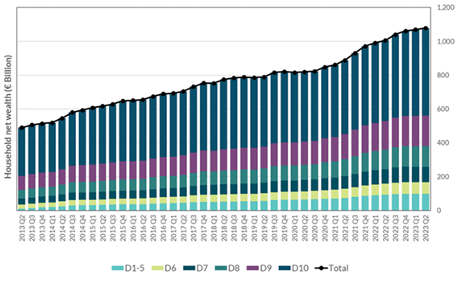

### ⮑ After
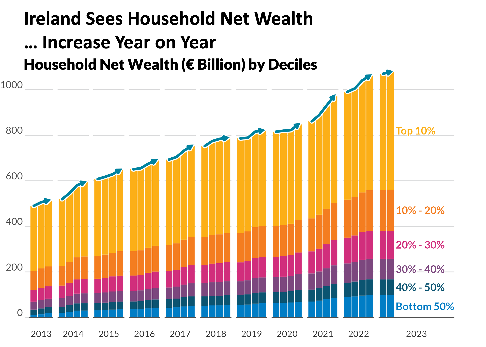

### 🗣️ Improvements Explained
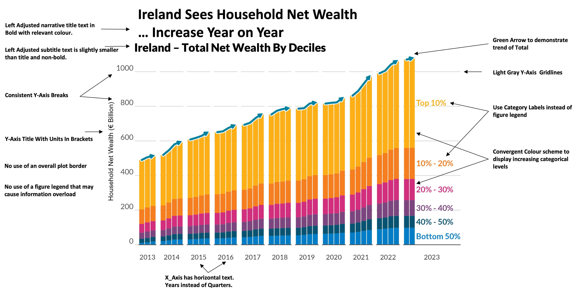

&nbsp;

## 🏠 Before Vs. After (Example 2: Loan Interest Rates) {#example2-redesign}

### ⮐ Before
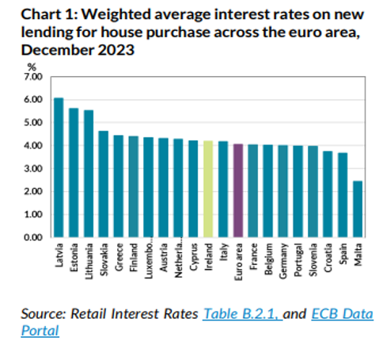

### ⮑ After

### 🗣️ Improvements Explained
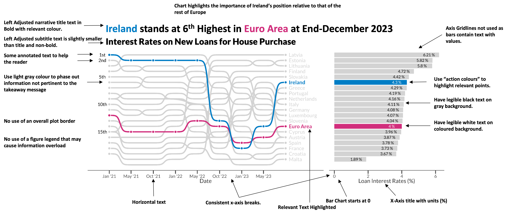

&nbsp;

## 🏃‍♂️ Example 3: Personal HYROX Data {#example3-redesign}

### ⮐ Before

Three separate charts describing HYROX Performance.

::: {layout-ncol=3}
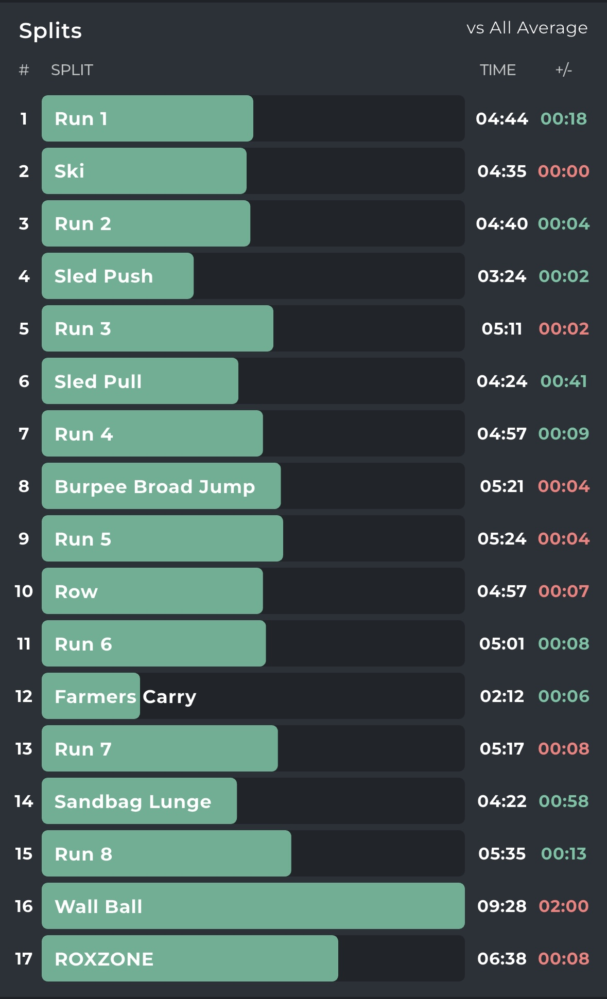

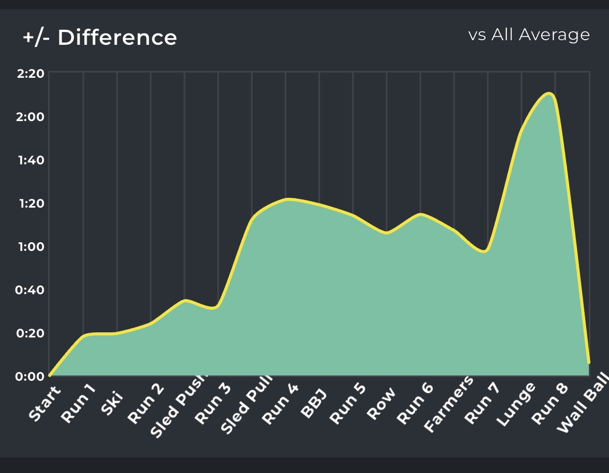

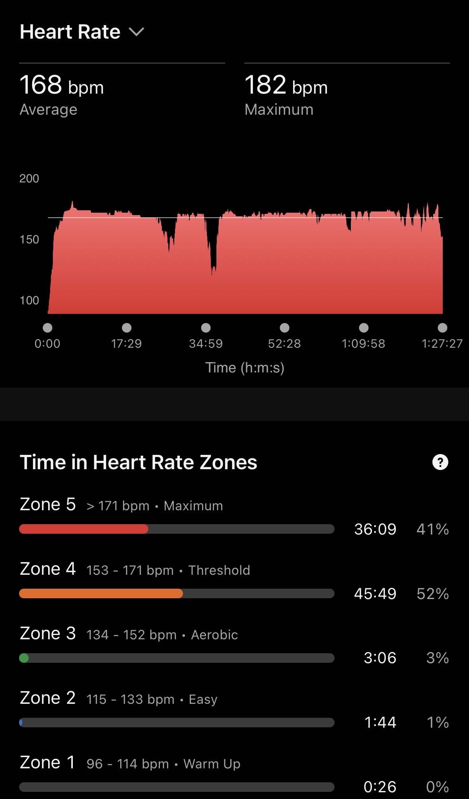
:::

### ⮑ After

Combination of three separate charts into a clean, single graphic.

#### Click Image to enlarge 👇
{.lightbox}

&nbsp;

## 🔨 Chart Redesign Process

### 1️⃣ Part 1: Pre-Chart Thinking
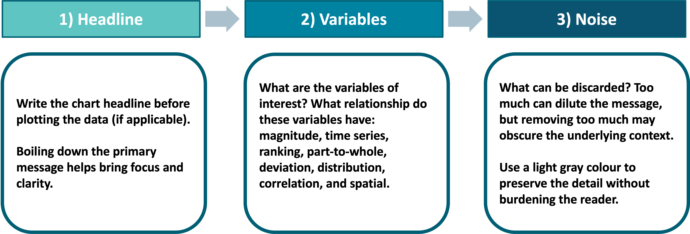

### 2️⃣ Part 2: Systematic Chart Redesign Template
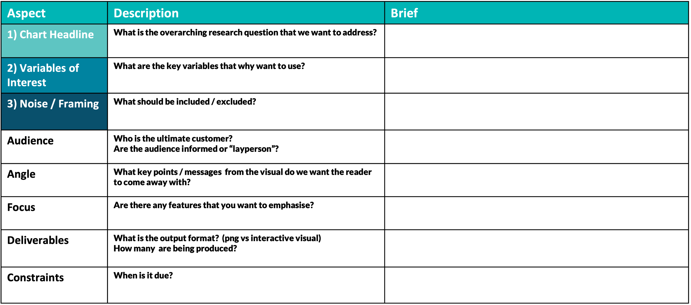

&nbsp;

## 🎨 Data Visualization Style Guide Creation

In 2024, I created a **Data Visualization Style Guide** for the **Central Bank of Ireland**, developed in collaboration with the Communications department. 

This guide formalised the institution’s approach to visual communication — ensuring that charts and dashboards across all departments followed a consistent, accessible, and design-informed standard.

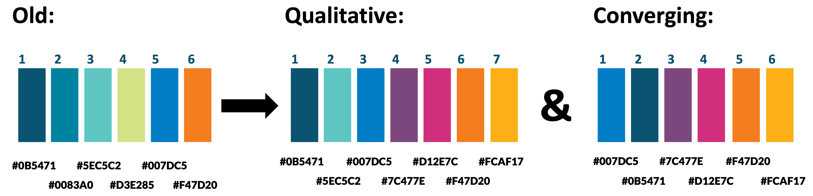

**Purpose of the Guide:**

- Establish color palettes aligned with accessibility and brand identity  
- Promote best practices for labeling, annotation, and storytelling  
- Standardise visual output across **RShiny** and publication workflows  

The guide has since been implemented to **elevate visual standards** and ensure **chart consistency** across the organisation.

📄 [View the Data Visualisation Style Guide (PDF)](pdf/CBI Data Viz Style Guide.pdf)

&nbsp;

## 🧑‍🏫 Teaching & Workshops

Alongside my redesign projects, I have **designed and delivered numerous data visualisation workshops**, ranging from **1-hour sessions** to **3-hour deep dives**, catering to both **technical** and **non-technical** audiences.

---

### 👨‍💻 Technical Workshops — *ggplot2 and Data Visualisation in R*

These sessions focus on developing hands-on skills using **ggplot2** and the **grammar of graphics** framework. 

Participants learn to:

- Build visuals layer by layer using R and ggplot2  
- Customise color, theme, and layout for professional-quality outputs  
- Apply design principles directly within R scripts  
- Use reproducible workflows to standardize internal reporting visuals  

**Example sessions include:**

- *“From Data to Design: An Introduction to ggplot2”*  

---

### 🖌️ Non-Technical Workshops — *Principles of Data Visualisation*

These sessions focus on **conceptual understanding** and **visual storytelling**.

Topics include:

- The **do's** and **dont's** in data visualisation
- Research-based appraoches that lead to greater chart engagement
- Applying best practices to enable charts of greater clarity 

**Example sessions include:**

- *“Design Thinking for Analysts”*

I have delivered these workshops within the **Central Bank of Ireland** where they have helped elevate in-house visualisation standards and design literacy.

---

## 💡 Key Takeaways

- **Effective visualization = design + communication**  
- Redesigning a chart is about understanding audience perception and context, not just aesthetics  
- Teaching others reinforces strong habits of clarity, simplicity, and storytelling in every visualisation  

---

## 🏁 Summary

This section of my portfolio reflects not only my ability to create impactful visuals, but also to **teach and empower others** to do the same — helping teams communicate data more clearly, confidently, and creatively.
