# 📊 Data Visualisations

Explore my data visualisation portfolio, as I showcase *ggplot2* skills in these diverse industries: 

* [Section 1: Finance Visuals](#finance-visuals) 
* [Section 2: Fitness Visuals](#hyrox-visuals) 
* [Section 3: Football Visuals](#football-visuals)

## 📈 Section 1: Finance Visuals {#finance-visuals}
[### 🧇 Waffle Chart 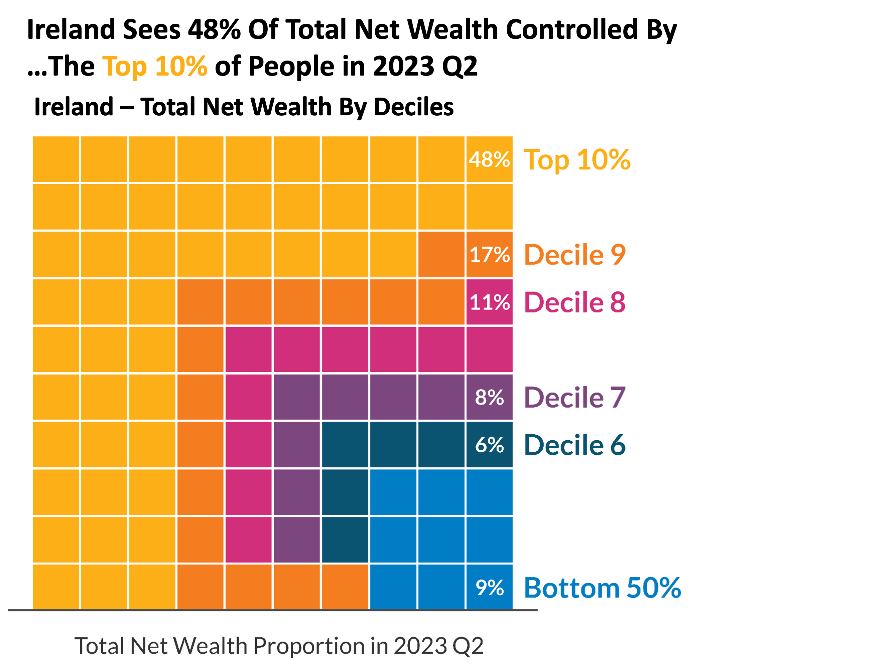]:

### 🍫 Vertical Bar Chart
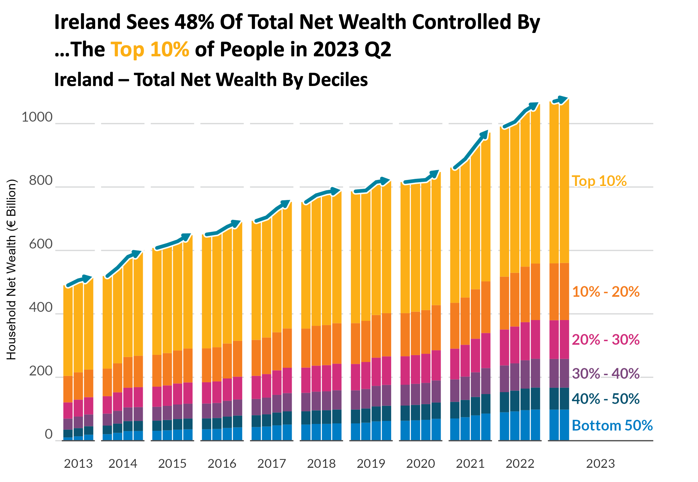

### 🗻 Bump Chart
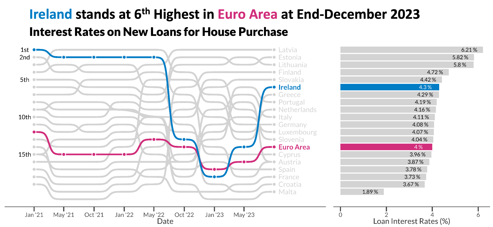

### 💹 Chart Combinations
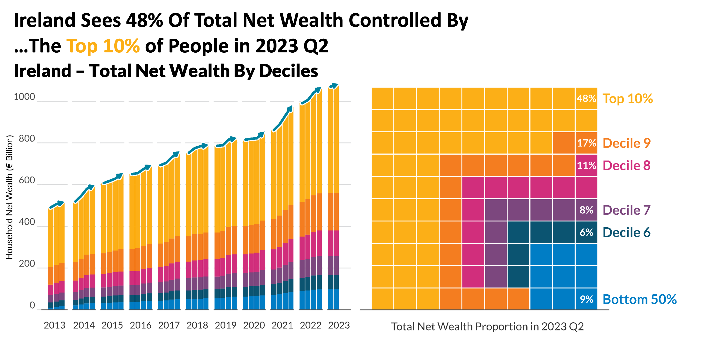

&nbsp;

## 💪 Section 2: Fitness Visuals {#hyrox-visuals}
### 🏋️ HYROX Combination Plot
#### Click Image to enlarge 👇
{.lightbox}

### 🏃 Running Combination Plot
#### Click Image to enlarge 👇
{.lightbox}

Code to generate your own running chart can be found here:
[https://github.com/andypetes94/fitnessPlotter](https://github.com/andypetes94/fitnessPlotter)

&nbsp;

## 📈 Section 3: Football Visuals {#football-visuals}
### ⚽️ Shot Map
#### Click Image to enlarge 👇
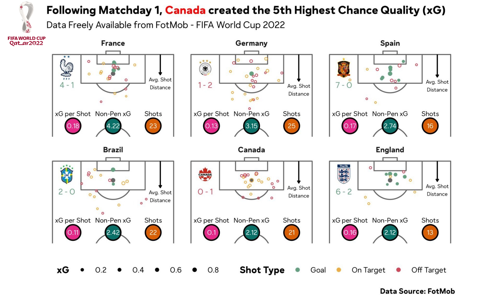{.lightbox}

### ️✚ Scatter Plot
#### Click Image to enlarge 👇
{.lightbox}

### ️% Percentile Plot
#### Click Image to enlarge 👇
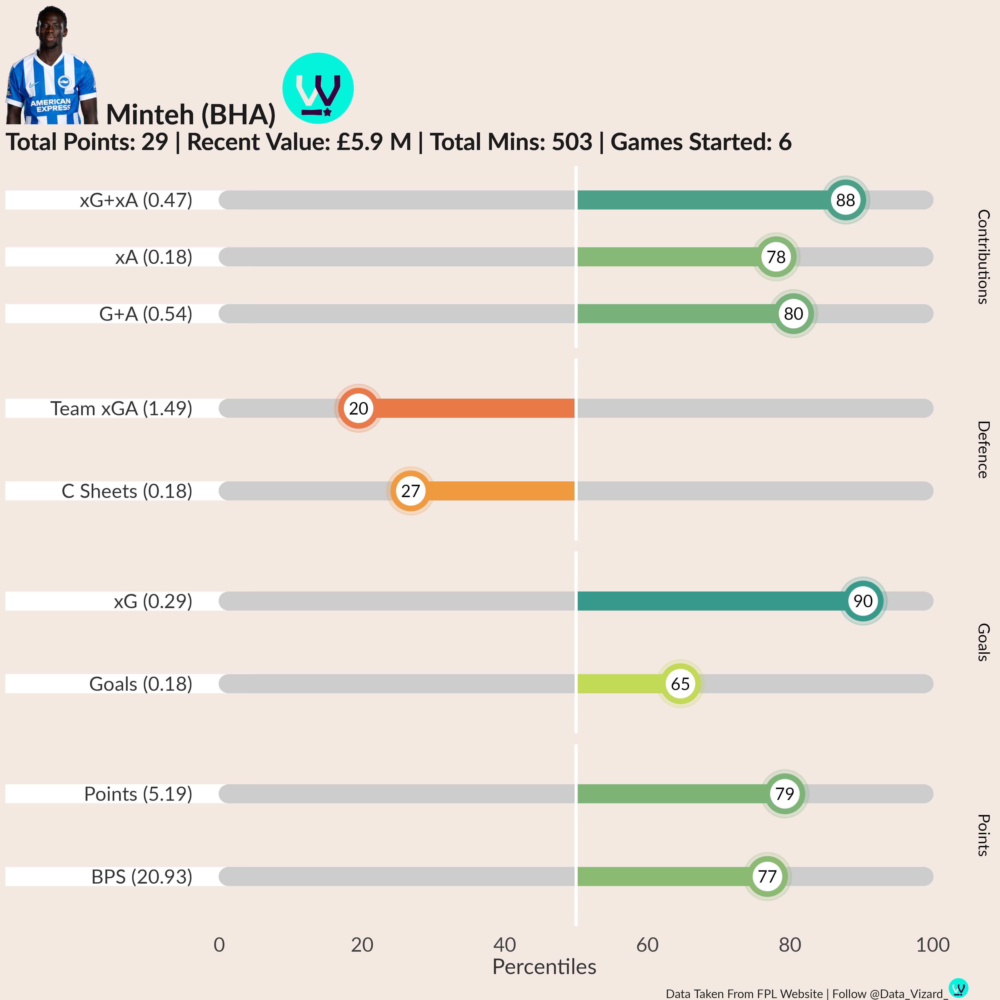{width=60% .lightbox}

### ⌗ Data Tables
#### Click Image to enlarge 👇
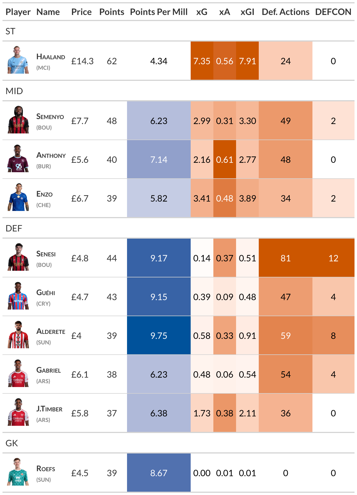{width=60% .lightbox}

### 🥶 Jitter Chart
#### Click Image to enlarge 👇
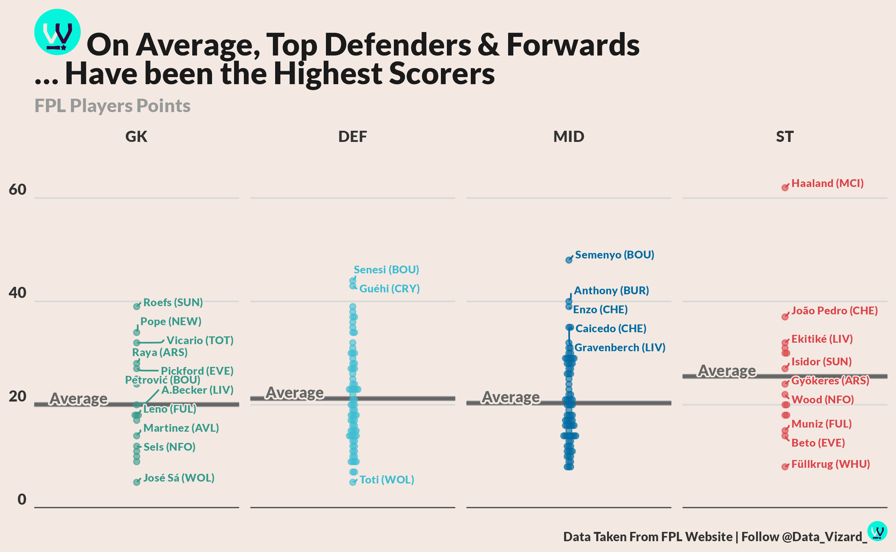{.lightbox}

### 💻 Minutes Matrix
#### Click Image to enlarge 👇
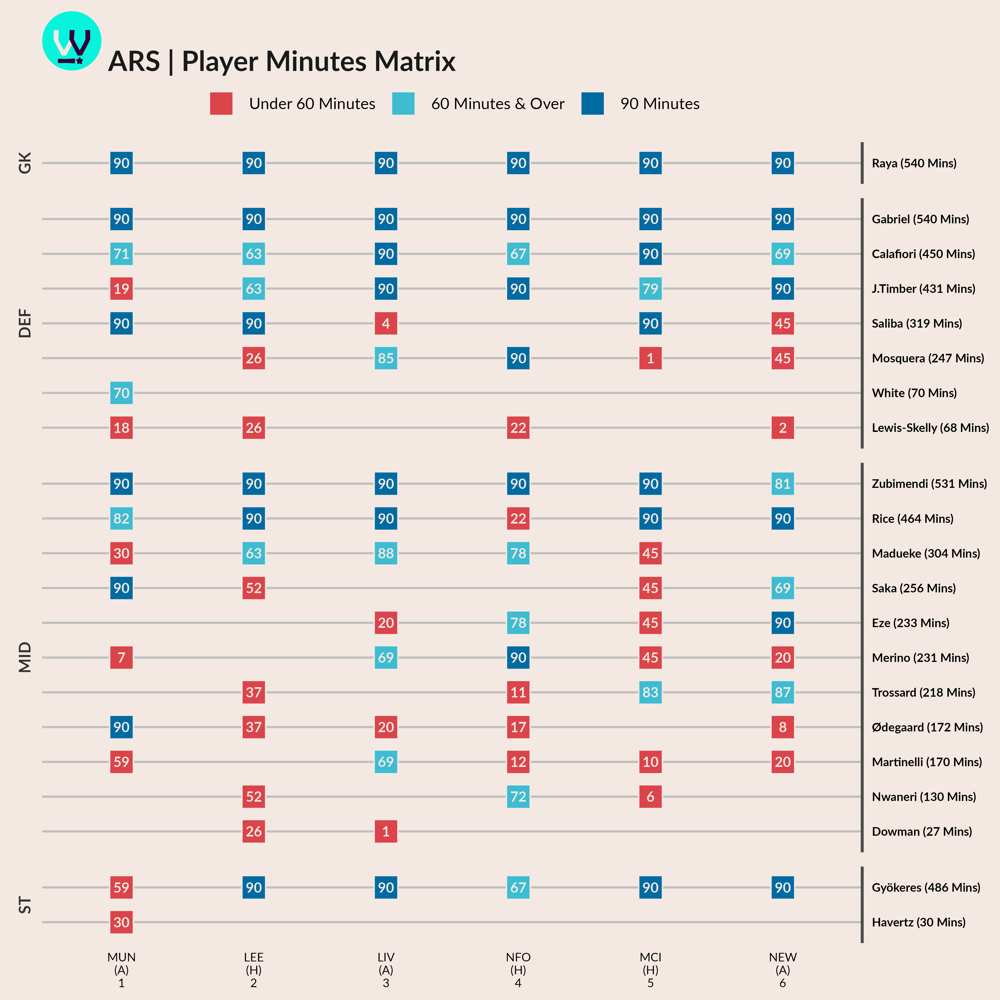{width=80% .lightbox}

### 🔺 Cumulative Points
#### Click Image to enlarge 👇
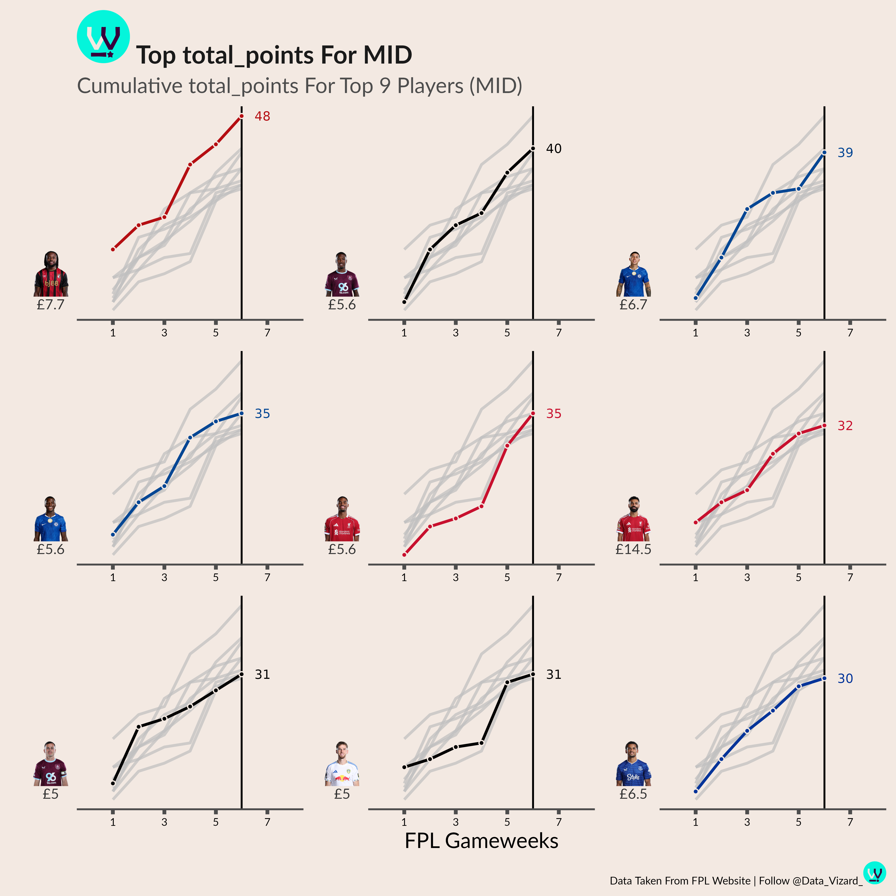{width=80% .lightbox}

<!-- ### 𝍁 Bump Chart -->
<!-- 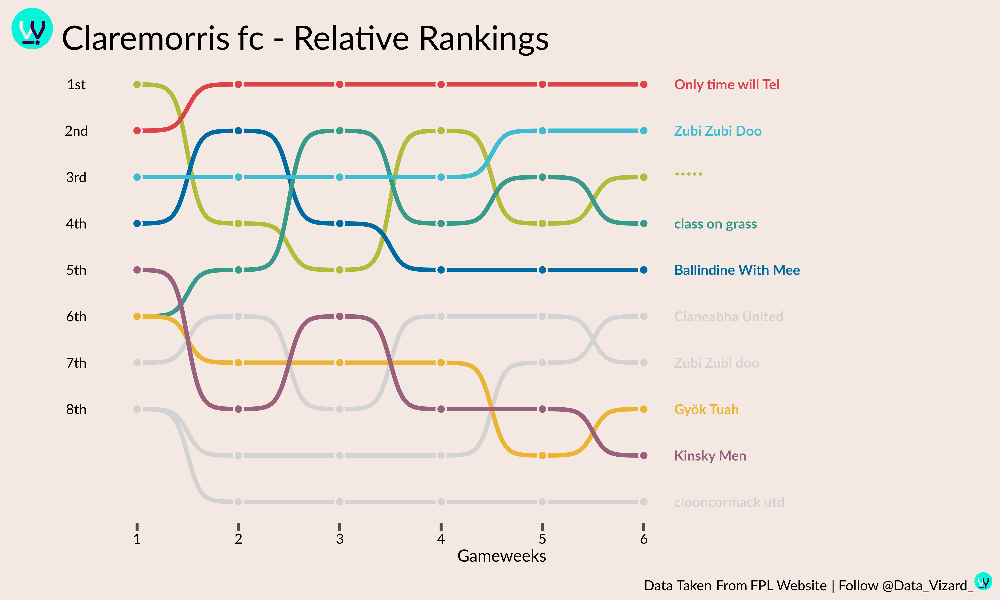 -->

### 📈 xG Trend Graph
#### Click Image to enlarge 👇
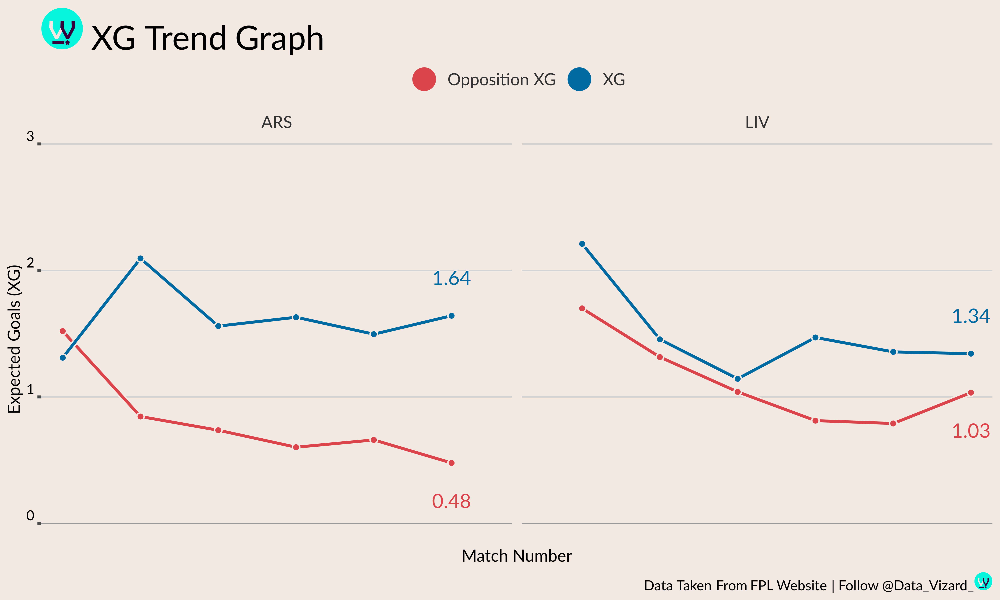{.lightbox}
